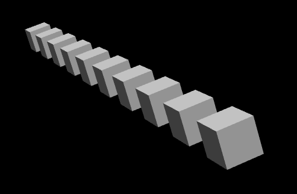
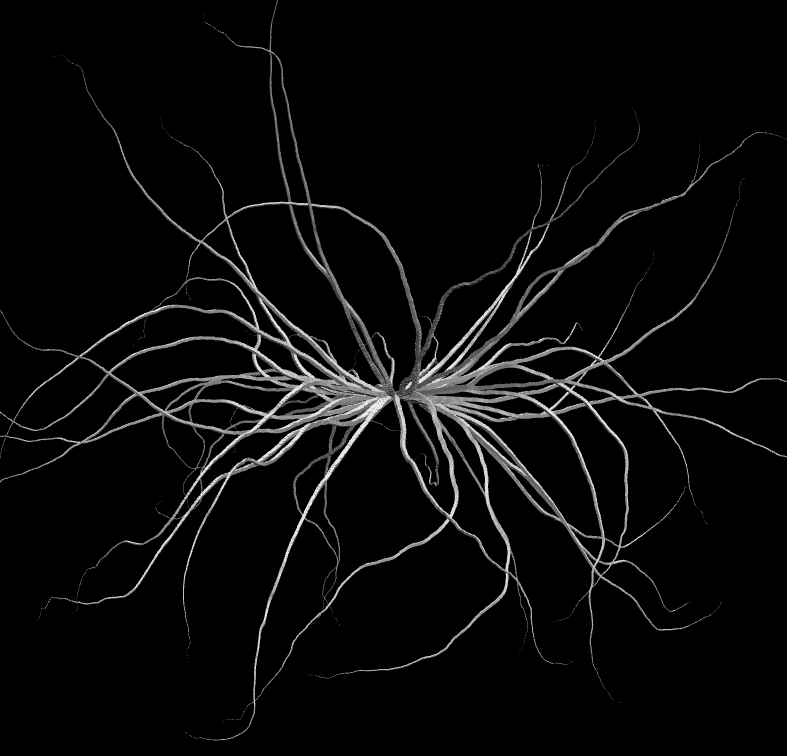
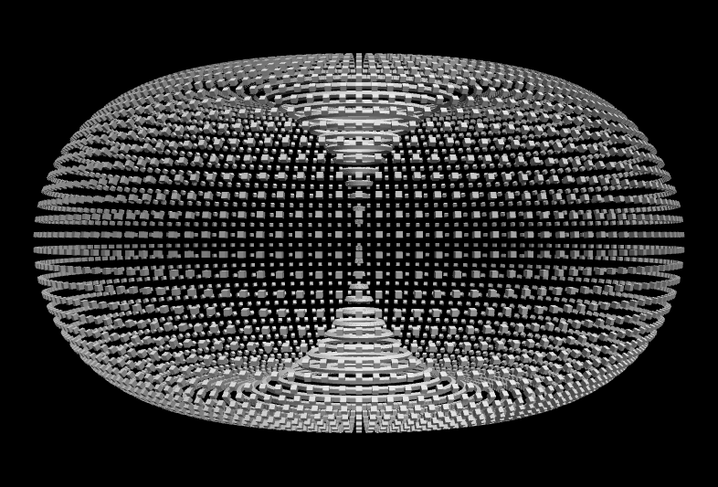
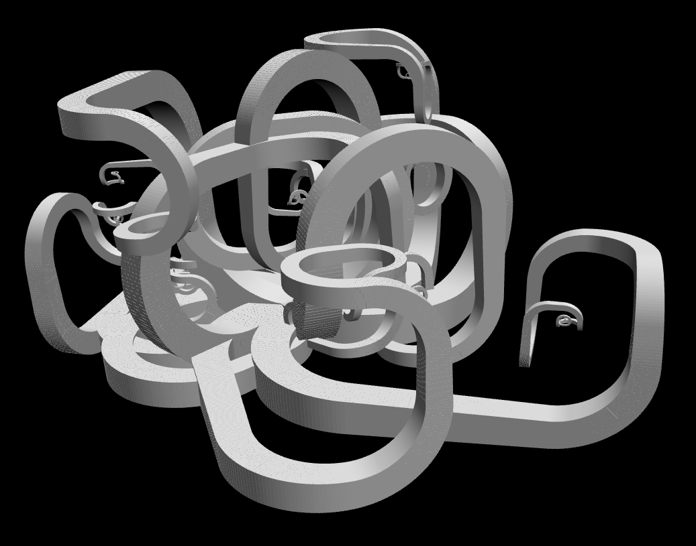

Burst is a C++/OpenGL Mac program for generating and displaying interesting 3D structures based on an L-System[^1] grammer.
It is heavily inspired by Structure Synth[^2].

For example, the following L-Sytem:

```
RULE maxdepth 9: box tx 2.0 RULE
```

contains one recursive rule that generates 10 boxes spaced 1 unit apart along the x axis:



See more examples below.

# Building

```
sh build.sh
```

# Running

```
./burst input_file
```

# Examples

## Tendrils

```
R0 maxdepth 45: ry 8.0 R0 (R1 R2)
R1 maxdepth 500: s 0.99 rz 5.0 rx 5.0 tx 1.0 box (R1 R2)
R2 maxdepth 500: s 0.99 rz -5.0 rx -5.0 tx 1.0 box (R1 R2)
```



## Torus

```
R0 maxdepth 144: R1 ry 2.5 R0
R1 maxdepth 72: box rz 5.0 ty 3.0 R1
```



## Nouveau

```
CENTER: R0 ry 30.0 R0 ry 30.0 R0 ry 30.0 R0 ry 30.0 R0 ry 30.0 R0 ry 30.0 R0 ry 30.0 R0 ry 30.0 R0 ry 30.0 R0 ry 30.0 R0 ry 30.0 R0
R0 maxdepth 50: (R1 R2 R3)
R1 maxdepth 45 nextrule R0: RBOX ry 2.0 tx 0.1 s 0.996 R1
R2 maxdepth 45 nextrule R0: RBOX rz 2.0 tx 0.1 s 0.996 R2
R3 maxdepth 20 nextrule R0: RBOX tx 0.1 s 0.996 R3
RBOX: sx 0.2 box
```



[^1]: https://en.wikipedia.org/wiki/L-system
[^2]: https://structuresynth.sourceforge.net/
